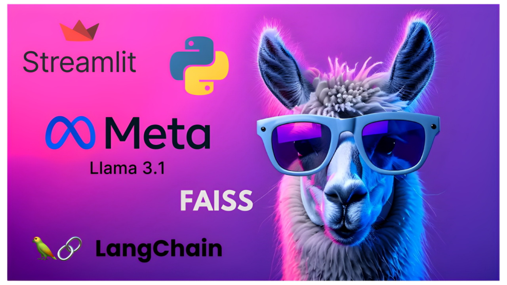

<h1 style="color: #fa7b24; 
               font-size: 90px; 
               text-align: center;">
        Doc Talk
</h1>

 

Made with ❤️ by ***[Rahul Bisht](https://www.linkedin.com/in/RahulB001/)***

### Application Workflow :

1. PDF get converted into vector embeddings
2. Save these embeddings in a vector database such as FAISS ,chroma DB or Pinecone. [One time Task ]
3. Generate vector embeddings for given prompt as well.
4. Perform a similarity search between given prompts and pdf embedding from the database.
5. return similar embeddings to model
6. summarize the embeddings and give a response to the user.

## Technology Used?

### Vector Databases :

  `vector databases` are a relatively new type of database optimized for storing, indexing, and querying high-dimensional vector data, often used in AI and machine learning applications, particularly for `similarity search` and `embedding-based` search tasks.

The key operation in vector databases is **similarity search**, which finds data points that are closest to a query vector in high-dimensional space.

1. What is a vector?
                    **Vectors** are mathematical representations (specifically, arrays or lists of numbers) that encode the properties or features of data points, such as words, images, or audio.
                     In AI, vectors are used to represent data in a way that neural networks and other machine learning models can interpret. These vectors are typically generated by models during training or inference, and they serve as a more compact and meaningful representation of the original data.
it  measures closeness or similarity between vectors.
2. what are embeddings in vector databases?

3. 

### LangChain :
